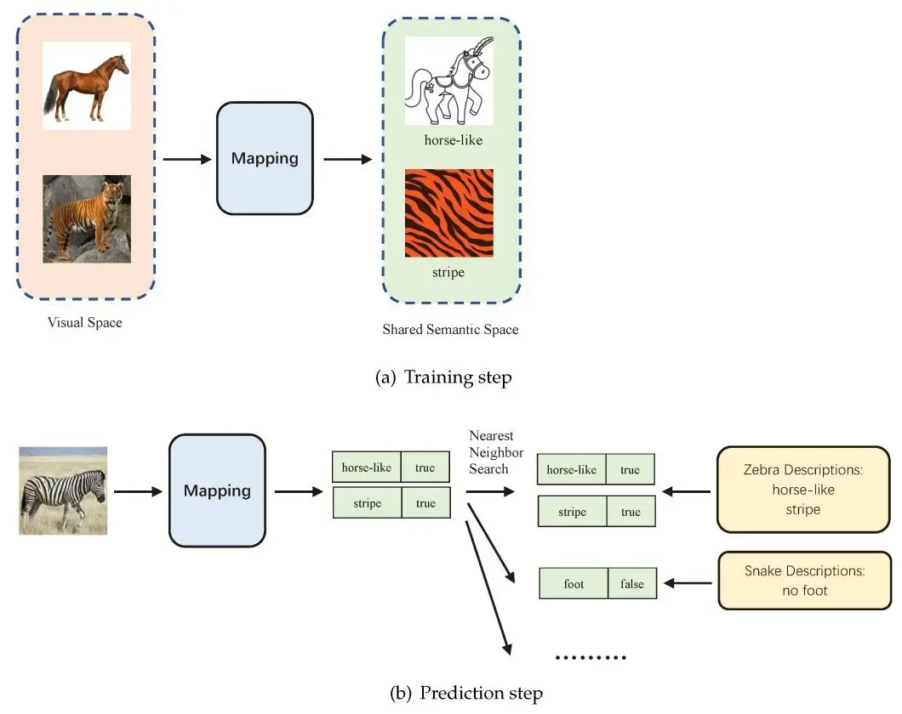
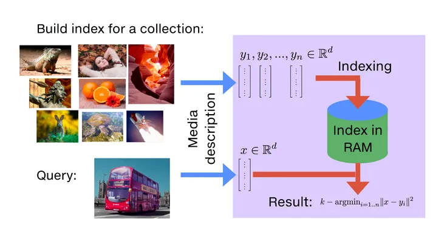

# Цифровой Прорыв, Межнар 2024

*MISIS Neychev Loss team*

Team Members:
1) **Максим Литвинов** - ML Engineer
2) **Александр Груздев** - ML Engineer
3) **Кирилл Рыжичкин** - ML Engineer

Презентация: [тык](google.com) ВСТАВИТЬ ПОТОМ ССЫЛКУ

Веб-сервис: [тык](http://fotorientir.itatmisis.ru:8501/)

## Кейс "Поиск смысловых копий изображений"

> Участникам предлагается разработать прототип или готовое к внедрению решение, способное находить смысловые копии изображений, которые представляют аналогичный сюжет, независимо от фона и типа изображения (рисунок или фото). Для демонстрации необходимо реализовать веб-интерфейс, который позволит загружать и обрабатывать изображения.

## Предложенное решение

*тут блок-схема всего решения с первых слайдов*

### Модели:
1) CLIP (`openai/clip-vit-base-patch32`), дообученный на кастомном лоссе (основное решение):

$$
\text{CombinedLoss} = 0.5 \cdot \text{TripletMarginLossWithDistance} + 0.5 \cdot \text{InfoNCE}
$$

Подробнее про InfoNCE: [Papers with Code](https://paperswithcode.com/method/infonce)

Учим пространство эмбеддингов так, чтобы эмбеддинги похожих по смыслу были близки, а далёких - далеки.
Время генерации эмбеддинга на GPU: `50ms`, на CPU: `180ms`.



2) Cross-attention Fusion Model w/ CLIP & BLIP (дополнительное решение):

*тут блок-схема будет потом*

Учим так, чтобы модели CLIP и BLIP извлекали взаимно полезную информацию друг из друга, таким образом каждая модель будет уточнять другую и делиться "знаниями", что важно в задаче смыслового поиска.

3) YOLO (`yolov8x-oiv7`) - предобученная на OIv7 датасете, просто достаём эмбеддинги с последнего слоя (дополнительное решение).

### Векторный поиск:

Используем `faiss` для быстрого и эффективного поиска по L2-расстоянию (эмбеддинги нормализованы, так что это аналогично поиску по косинусному расстоянию).

Поиск 20 ближайших соседей для данного фото среди 21000 фото из обучающей выборки занимает `0.5s` на GPU и `2s` на CPU.



### Фичи:

1) Выделение фото из скринов сайтов (не учитываем фон), работа с коллажами (находим все фото коллажа и работаем с ними отдельно)
2) С помощью `yolov8x-oiv7` проводим детекцию объектов на изображениях, чтобы выделить их контекст для пользователя (выделение ключевых объектов)

## Запуск:


1) Клонируем репозиторий 
```
git clone https://github.com/l1ghtsource/db_international_2024.git
cd db_international_2024
```
2) Создаём или используем готовое виртуальное окружение 
```
source environments/hack/bin/activate
```
3) Устанавливаем необходиимые зависимости
```
pip install -r requirements.txt
```
4) Запускаем обучение/инференс моделей в терминале, передав нужные аргументы
```
python /src/main.py --mode <choose train or inference> 
                   --data-path <path_to_your_dataset> 
                   --save-model-path ./logs/<name_of_your_experiment>.pth 
                   --wand-key <your_wandb_api_key>
``` 
5) Для запуска Streamlit сервиса
```
streamlit run service/streamlit_app.py
```
